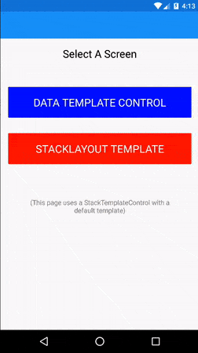
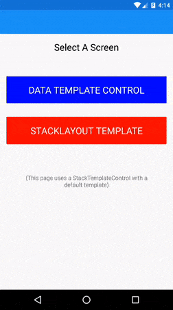

***SaltyDogControls*** is a library of Xamarin Forms controls that renders xaml/ui at rutime, providing more flexible UIs without having to rely work arounds such as toggling IsVisible on various 
groups of controls. Currently **SaltyDogControls** has two controls: `DataTemplateControl` which renders a single DataTemplate in a ContentView, and `StackTemplateControl` which iterates of an `ItemsSource` and applies templates to each item as children of a StackLayout.

These two controls provide ways of leveraging the flexibilty of DataTemplates. Here are some implications of how this can be used:

* Can provide DataTemplates for certain classes in the global ResourceDictionary, and reuse them in various pages.
* Can dynamically render parts of the Xaml depending on the type of data.
* Converters can be used for smarter lookup logic.

## DataTemplateControl

Dynamically selects and applies a DataTemplate to the BindingContext at runtime. Template selection will automatically change as the Selector property
changes. Rendered DataTemplates are bound as well.

Example Xaml:

<code>

	<ContentPage 
		xmlns="http://xamarin.com/schemas/2014/forms"
		xmlns:x="http://schemas.microsoft.com/winfx/2009/xaml"
		xmlns:sd="clr-namespace:SaltyDog;assembly=SaltyDogControls"
		Title="{Binding WidgetName}"
		x:Class="DataTemplateSample.TemplateControlPage">

		<ContentPage.Resources>
			<ResourceDictionary x:Name="resDict">

				<x:Array x:Key="TemplateList" Type="{x:Type x:String}">
					<x:String>Template 1</x:String>
					<x:String>Template 2</x:String>
				</x:Array>

				<DataTemplate x:Key="Template 1">
					<ScrollView Orientation="Vertical">
						
						<StackLayout Orientation="Vertical">
							<Label Text="Name:" TextColor="Black" />
							<Label Text="{Binding WidgetName}" TextColor="Black" FontSize="Medium" Margin="8,0,0,0"/>
							<Label Text="Description:" TextColor="Black" />
							<Label Text="{Binding WidgetDescription}" TextColor="Black" FontSize="Medium"/>
							<Label Text="Price:" TextColor="Black" />
							<Label Text="{Binding WidgetPrice}" TextColor="Black" FontSize="Medium"/>
							<Image Source="{Binding WidgetImage}" />
						</StackLayout>

					</ScrollView>
				</DataTemplate>

				<DataTemplate x:Key="Template 2">
					<Grid>
						<Grid.RowDefinitions>
							<RowDefinition Height="*" />
							<RowDefinition Height="*" />
							<RowDefinition Height="*" />
						</Grid.RowDefinitions>
						<Grid.ColumnDefinitions>
							<ColumnDefinition Width="*" />
							<ColumnDefinition Width="*" />
						</Grid.ColumnDefinitions>
						<Image 
							Source="{Binding WidgetImage}" 
							Grid.ColumnSpan="2" 
							Grid.Row="0" 
							Grid.Column="0" />
						<Label Text="{Binding WidgetName}" TextColor="Black" FontSize="Small" Grid.Row="1" Grid.Column="0" />
						<Label Text="{Binding WidgetDescription}" TextColor="Black" FontSize="Micro"  Grid.Row="1" Grid.Column="1" />
						<Label Text="{Binding WidgetPrice}" TextColor="Black" FontSize="Large"  Grid.Row="2" Grid.ColumnSpan="2"/>
					</Grid>
				</DataTemplate>

			</ResourceDictionary>
		</ContentPage.Resources>

		<StackLayout Spacing="0" Padding="16">

			<Label Text="Widget Viewer" HorizontalOptions="Center" TextColor="Blue" FontSize="Large" Margin="0,0,0,16" />

			<Label Text="Choose Widget Template:" TextColor="Black" FontSize="Medium" />

			<Picker x:Name="ThePicker" ItemsSource="{StaticResource TemplateList}" SelectedIndex="0" Margin="0,0,0,32" />

			<sd:DataTemplateControl Padding="0" VerticalOptions="FillAndExpand"  HorizontalOptions="FillAndExpand" 
				Selector="{Binding Source={x:Reference ThePicker}, Path=SelectedItem}"
				TemplateDictionary="{Binding Source={x:Reference resDict}}" 
				/>

		</StackLayout>

	</ContentPage>

</code>

* `Selector` is the property used to lookup the template by name. The value is any object, but is converted to a string at runtime. Can be used with a converter.
* `TemplateDictionary` is an `IDictionary<string, object>` from which the DataTemplate is retrieved. This can be set to a `ResourceDictionary`, or any implementation of `IDictionary<string,object>` 

## StackTemplateControl

Dynamically selects and applies a DataTemplate to each item in the `ItemsSource` at runtime. Each item must implement the `INameTemplate` interface to select the template. Alternatively a default template can be applied to each item.

This is not intended to be a replacement for ListView. ListView is optimized for large lists of data. StackTemplateControl does not face some of the focus challenges that ListView does for editing data.

Example Xaml:

<code>

	<ContentPage xmlns="http://xamarin.com/schemas/2014/forms"
			 xmlns:x="http://schemas.microsoft.com/winfx/2009/xaml"
			 xmlns:sd="clr-namespace:SaltyDog;assembly=SaltyDogControls"			 
			 x:Class="DataTemplateSample.Pages.QuestionnairePage">
		<ContentPage.Resources>
			<ResourceDictionary x:Name="resDict">

				<DataTemplate x:Key="StringQuestion">
					<StackLayout>
						<Label Text="{Binding DisplayName}" TextColor="Black" FontSize="Medium"/>
						<Label Text="{Binding QuestionType}" />
						<Entry Keyboard="Default" Text="{Binding Value}" />
					</StackLayout>
				</DataTemplate>

				<DataTemplate x:Key="IntQuestion">
					<StackLayout>
						<Label Text="{Binding DisplayName}" TextColor="Black" FontSize="Medium"/>
						<Label Text="{Binding QuestionType}" />
						<Entry Keyboard="Numeric" Text="{Binding Value}" />
					</StackLayout>
				</DataTemplate>

				<DataTemplate x:Key="BooleanQuestion">
					<StackLayout Orientation="Vertical">
						<Label Text="{Binding DisplayName}" TextColor="Black" FontSize="Medium"/>
						<Label Text="{Binding QuestionType}" />
						<Switch IsToggled="{Binding Value}" />
					</StackLayout>
				</DataTemplate>

			</ResourceDictionary>
		</ContentPage.Resources>

		<StackLayout Spacing="0" Padding="16">

			<sd:StackTemplateControl 
				x:Name="stackTemplate"
				Spacing="0" 
				Padding="16" 
				ItemsSource="{Binding Questions}"
				TemplateDictionary="{Binding Source={x:Reference resDict}}"
				>
			</sd:StackTemplateControl>
			<Button Text="Submit" Command="{Binding CmdSubmit}" />
		</StackLayout>

	</ContentPage>

</code>

With item types defined as follows:

	public enum QuestionType
	{
		StringQuestion, IntQuestion, BooleanQuestion
	}

	public class Question : ITemplateSelector
	{
		public string DisplayName { get; set; }
		public QuestionType QuestionType { get; set; }
		public object Value { get; set; }

		public string TemplateName => QuestionType.ToString();
	}

* `ItemsSource` is the property from which item data is taken, DataTemplates looked up, rendered, and bound.
* `TemplateDictionary` is an `IDictionary<string, object>` from which the DataTemplate is retrieved. This can be set to a `ResourceDictionary`, or any implementation of `IDictionary<string,object>` 
* `DataTemplate` is a template that can be applied to each item. This allows simple lists of items to be rendered in a StackLayout.

If you have any questions, or would like specific cusomizations post an issue, or contact the author at curtis@saltydogtechnology.com.

